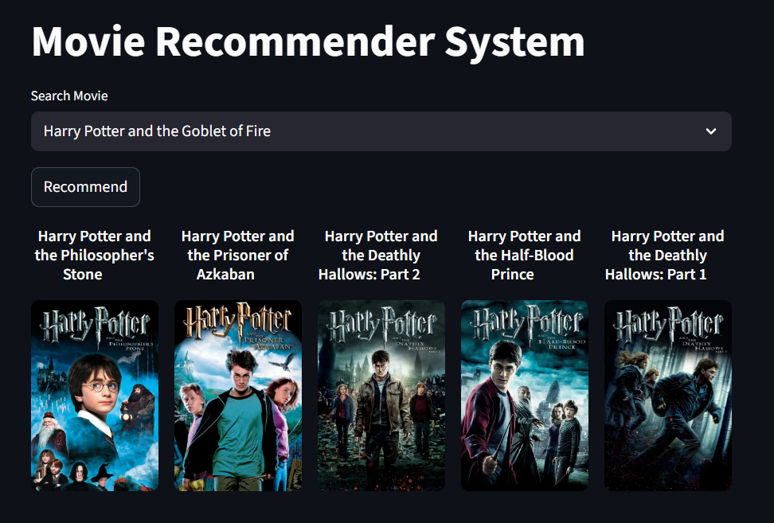

# 📽️ MovieFix: A Smart Movie Recommendation System
MovieFix is a scalable and end-to-end movie recommendation system that leverages semantic embeddings to deliver personalized movie suggestions. It extracts and processes movie data from the TMDB API, generates embeddings using a Sentence Transformer, and uses FAISS for fast similarity search. The system features an interactive Streamlit web app, allowing users to discover movies based on storyline and semantic similarity rather than generic ratings.


## Live Demo
Try MovieFix in Action - [https://moviefix-wwbhgya5fgxfyj5q7dkzuf.streamlit.app/](https://moviefix-wwbhgya5fgxfyj5q7dkzuf.streamlit.app/)


## Tech Stack 
- Python: pandas, NumPy, requests (for REST API)
- HuggingFace: Sentence Transformer
- FAISS: Vector similarity search
- Streamlit: Interactive frontend UI


## Data Source
This project uses movie metadata and content from the [TMDB (The Movie Database) API](https://www.themoviedb.org/documentation/api) as its primary data source. 


## Key Features
- Batch Extraction: Fetches movie data from TMDB API.
- Seamless Loading: Stores raw data efficiently in CSV format.
- Data Cleaning: Transforms and prepares data for recommendations.
- Semantic Embeddings: Captures movie meaning with Sentence Transformers.
- Fast Vector Search: Finds similar movies instantly using FAISS.
- Interactive App: Real-time, storyline-based recommendations via Streamlit.


## Streamlit App Screenshots
<p float="left">
  
  
</p>


## Setup
1. Clone the repository
```
   git clone <repo-url>
```

2. Install dependencies:
```
pip install -r requirements.txt
```

3. Set up API keys in .env file (TMDB).

4. Run Streamlit App
```
cd src/frontend
streamlit run app_embed.py
```

## Usage
- Data Extraction and Loading: `python src/elt/extract_load.py ...`
- Transform: `python src/elt/transform.py ...`
- Vectorize: `python src/vectorize.py ...`
- Recommend: `python src/recommend.py ...`
- Streamlit app: `streamlit run src/frontend/app_embed.py`
- Results: `cd results/recommendations.csv`